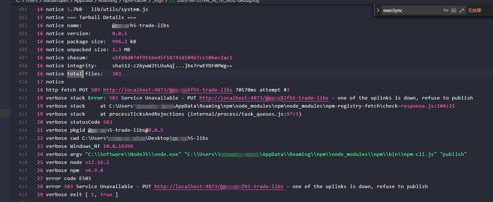
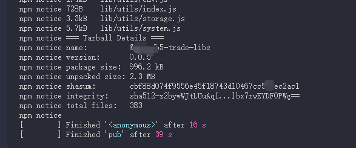

由于项目共享组件库的需要，我们搭建了npm私有服务器，供本公司几个项目可以访问。组件库使用gulp+webpack+npm进行打包构建，私服使用的是 **Verdaccio**直接搭建的，一键式傻瓜搭建，贼好使，使用方法指路 [http://auan.cn/internet/2010.html](http://auan.cn/internet/2010.html "大佬")。

原由：

使用gulp+npm（npm run pub）往私服上推包的时候，报错E503错误，但是直接使用npm publish可以直接上传成功。

解决方法：

将**Verdaccio的storage**文件夹下的本依赖的文件夹删掉，再重新使用npm run pub上传。在网上没有查找到关于这个的报错的，从错误码来看是本地服务的报错，但是在解决问题过程中，我localhost服务并没有进行重启。所以应该是删除掉storage的缓存后重新上传解决的问题。我的storage本地的路径是C:\Users\xiaoxin.qiao\AppData\Roaming\verdaccio\storage，供大家参考。

