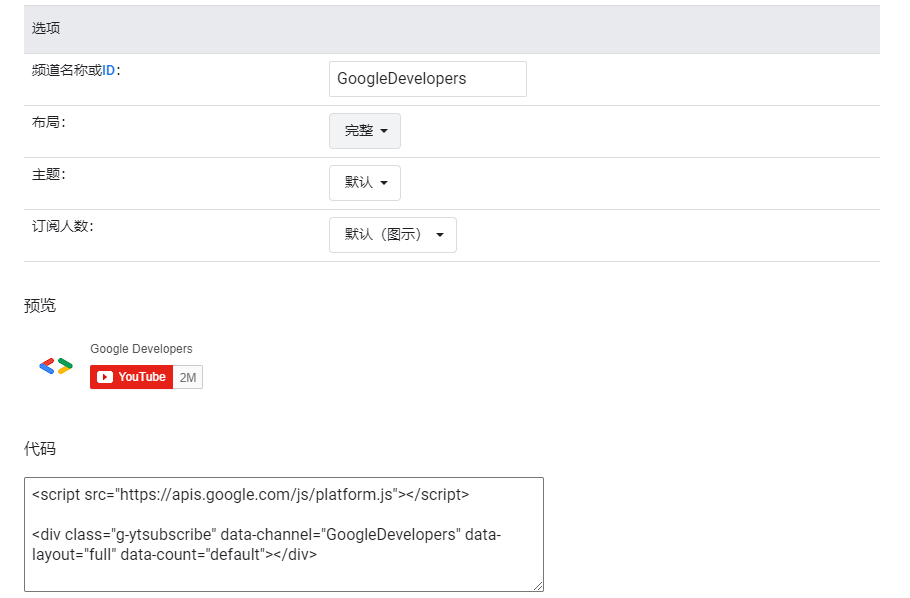
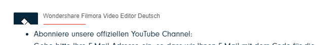
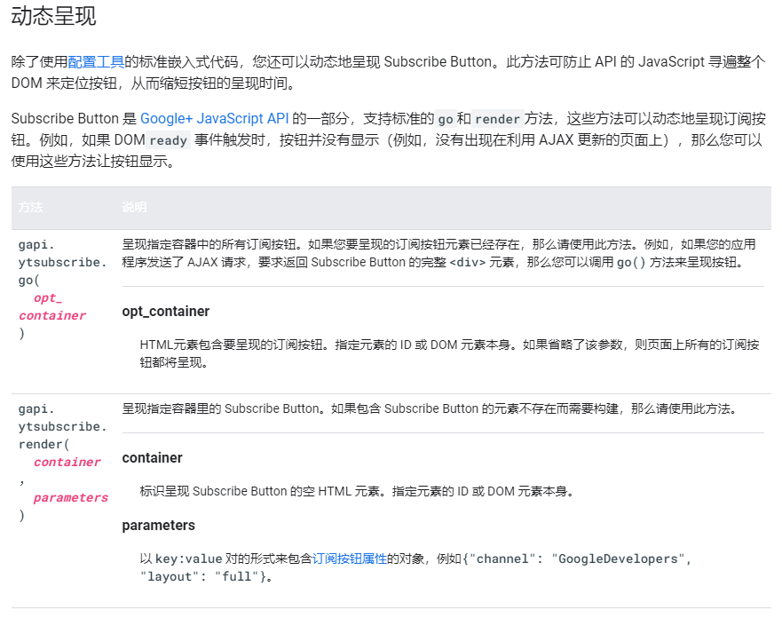

背景：公司网站业务在做海外营销网站，为了配合营销工作，前端总要在各种地方添加各种社媒订阅；最近遇到的是在弹窗内展示公司的Youtube账号的订阅按钮。

理想：我想使用的例子是这样的：



现状：但是当我实际使用的时候，却只显示了一半，如下图：



 解决问题思路：

1. 起初，我以为是加载的外部js先执行的原因，所以将script加了defer属性（延迟执行），发现没有任何效果;

2. 其次，还是老老实实去查了官方文档[https://developers.google.com/youtube/subscribe/reference](https://developers.google.com/youtube/subscribe/reference)：

官方api提供了很多功能的go/render方法，动态渲染订阅按钮或其他功能：



 3. 最后我在bootstrap弹窗加载完的钩子函数中调用了gapi.ytsubscribe.render方法，实现了功能，代码如下：
```html
<!--#modal-sample-lg-->  
  
<script src="https://apis.google.com/js/platform.js"></script>

<div id="yt-button-container-render" class="g-ytsubscribe"></div>

<!--#modal-sample-lg-->

<script>
$(function() {
    var acount = 0;
    $('#modal-sample-lg').on('shown.bs.modal', function () {
        // 只加载一次，避免闪烁
        if(acount === 0) {
            var container = document.getElementById('yt-button-container-render');
            var options = {
                'channelid': 'UCv1uPumg4LFFC9qwYWKyxhw',
                'layout': 'full',
                'count': 'hidden',
            };

            gapi.ytsubscribe.render(container, options);
            acount++;
        }
    })
})
</script>
```

最后：将go实现的代码放到下面：

```html
<!-- modal-sample-lg callback begin -->
<!-- #modal-sample-lg -->
<script src="https://apis.google.com/js/platform.js"></script>
<div id="yt-button-container-go"></div>
<!-- #modal-sample-lg -->
<script>
    $('#modal-sample-lg').on('shown.bs.modal', function () {
        var container = document.getElementById('yt-button-container-go');
        var div = '<div class="g-ytsubscribe" data-channelid="UCv1uPumg4LFFC9qwYWKyxhw" data-layout="full" count="hidden"></div>'
        container.innerHTML = div;
        gapi.ytsubscribe.go(container);
    })
</script>
<!-- modal-sample-lg callback end -->
```

总结：

1. 在过程中也尝试了方法，比如说使用默认的订阅按钮（不满足需求），或者说将引入的官方js放到最后，结果都没有达到目的；

2. 究其原因，默认的订阅按钮是页面加载完后就已经加载结束了，而data-layout="full"，表示高度和宽度是由内容撑开的，在初始化的时候由js动态加载的logo图片还没有加载到dom树中，高度没有被撑开，订阅按钮显示不完整；

3. 想到这里，若给订阅按钮最小高度，应该也是可以的（刚去验证了一下，果然是可以的，但是必须使用px，不可以使用rem，因为订阅按钮是使用iframe承载的......）

4. 浏览器渲染机制博大精深，继续学习~

4. 虽然Youtube订阅国内不常用，但是记录一下~