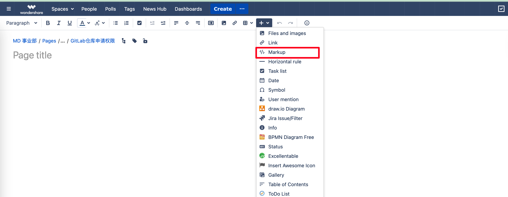

分享一下markdown =>confluence 创建表格的思路；

这是markdown表格的写法：

```markdown
| repo | 需要 Maintainer | 需要 Developer |

|------|----------------|----------------|

| # mockingbot / 设计画布 (aboard) / sketch-aboar | 乔晓欣 | 乔晓欣 |

| # mockingbot / 设计画布 (aboard) / mb-aboard | 乔晓欣 | 乔晓欣 |

| # mockingbot / 设计工具 (sigma) / psdk | 乔晓欣 | 乔晓欣 |

```

这是confluence的写法：

```confluence
|| repo || 需要 Maintainer || 需要 Developer ||  
| mockingbot / 设计画布 (aboard) / sketch-aboard | 乔晓欣 | 乔晓欣 |  
| mockingbot / 设计画布 (aboard) / mb-aboard | 乔晓欣 | 乔晓欣 |  
| mockingbot / 设计工具 (sigma) / psdk | 乔晓欣 | 乔晓欣 |  
| mockingbot / 设计工具 (sigma) / mb-vector-editor | 乔晓欣 | 乔晓欣 |

```

confluence与markdown的写法，只有表头不一致，表体是一致的；
将markdown语法改写成 confluence 写法就可以在confluence批量插入表格啦~
将confluence 内容粘贴到markup中就可以啦~

