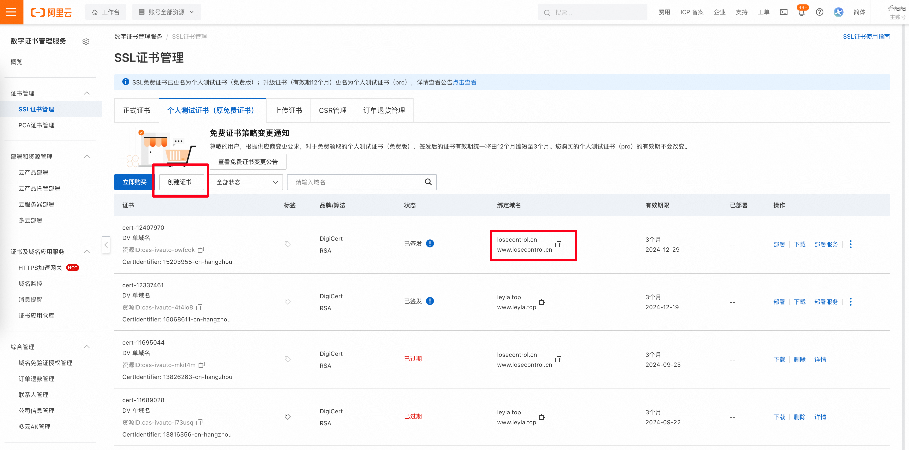

1. [打开阿里云ssl证书管理中心](https://yundun.console.aliyun.com/?spm=5176.100251.console-base_search-panel.dtab-product_cas.57b84f15NrTQfV&p=cas#/certExtend/free/cn-hangzhou)


2. 复制已过期的证书的域名，创建证书



3. 按照默认设置创建完成后，下载证书，下载至本地为zip包，将zip包解压后有2个文件，文件名均为域名，文件后缀为pem和key


4. 将pem和key文件更新至云服务器的 `/usr/local/nginx/conf/cert` 文件夹下

5. 命令行重新加载并启动Nginx
  ```bash
  /usr/local/nginx/sbin/nginx -s reload
  ```
