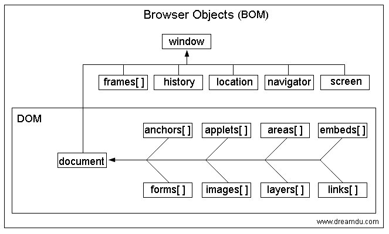

包含关系，DOM 是 BOM 的成员之一
名词解释：
- BOM（brower object model）：浏览器对象模型
- DOM（document object model）：文档对象模型

BOM 包括以下内容：

- document (DOM)
- frames
- history
- location
- navigator
- screen

参考资料
- https://github.com/baurine/frontend-basic/blob/master/notes/javascript-bom.md