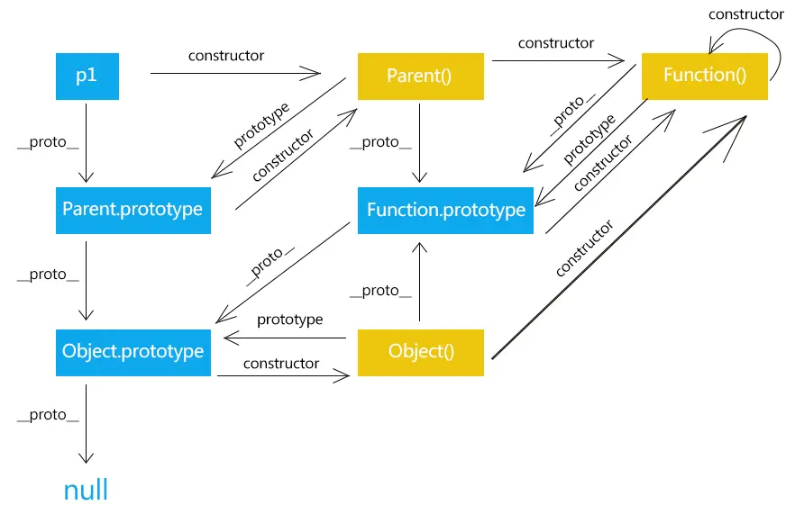
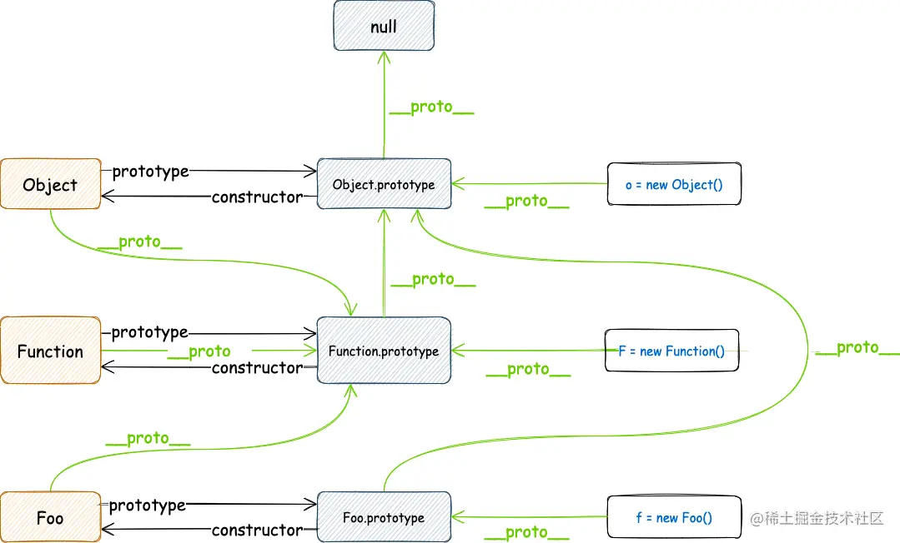

### 开篇
1. `__proto__ ` 和 `constuctor` 是对象独有的属性
2. `prototype` 是函数独有的属性
3. 函数作为对象的子类型，同时拥有 `prototype` 、`__proto__ ` 和 `constuctor` 属性；使用字面量创建的函数，没有 `prototype` 属性，使用 function 关键字创建的函数，有 `prototype` 属性。






`Person.prototype` 和 `Person.__proto__` 是 JavaScript 中两个不同的属性，它们在对象和函数的原型链中扮演不同的角色。以下是它们的区别：

### `Person.prototype`

- **定义**：`prototype` 是函数对象的一个属性，用于定义由该函数创建的对象的原型；函数也是对象，function是object的子类型。
- **用途**：当使用 `new Person()` 实例化一个新对象时，新对象的 `__proto__` 属性将指向 `Person.prototype`。
- **类型**：对象。
- **标准化**：`prototype` 是 ECMAScript 标准的一部分。

### `Person.__proto__`

- **定义**：`__proto__` 是每个 JavaScript 对象都有的一个内部属性，它指向该对象的原型（即构造函数的 `prototype` 属性）。
- **用途**：用于访问和设置对象的原型。
- **类型**：对象。
- **标准化**：虽然 `__proto__` 是许多 JavaScript 引擎实现的，但它并不是正式的 ECMAScript 标准的一部分。现代 JavaScript 使用 `Object.getPrototypeOf` 和 `Object.setPrototypeOf` 来获取和设置原型。

### 示例
```js
// 定义一个构造函数
function Person(name) {
    this.name = name;
}

// 向构造函数的 prototype 添加方法
Person.prototype.sayHello = function() {
    console.log(`Hello, my name is ${this.name}`);
};

// 创建一个实例对象
const alice = new Person('Alice');

// __proto__ 指向构造函数的 prototype
console.log(alice.__proto__ === Person.prototype); // true

// prototype 是构造函数的属性
console.log(Person.prototype); // { constructor: Person, sayHello: [Function] }

// Person.__proto__ 指向 Function.prototype，因为 Person 是一个函数
console.log(Person.__proto__ === Function.prototype); // true

// Person 作为 Function 的实例（在js中，所有函数都是 Function 类型的实例）
console.log(Person instanceof Function); // true，Person 是 Function 的实例

// Function.prototype.__proto__ 指向 Object.prototype
console.log(Function.prototype.__proto__ === Object.prototype); // true

// Object.prototype.__proto__ 是 null
console.log(Object.prototype.__proto__ === null); // true

```


### 总结

- `Person.prototype` 是构造函数的属性，用于定义由该构造函数创建的对象的原型。
- `Person.__proto__` 是构造函数对象的原型，通常指向 `Function.prototype`，因为构造函数本身是一个函数。

它们在原型链中共同作用，允许对象继承属性和方法。

```js

// 所有构造函数的`__proto__`(包括`Function`和`Object`)都指向`Function.prototype`。
// String、Number、Boolean、Date
console.log(Object.__proto__ === Function.prototype) // true
console.log(Function.__proto__ === Function.prototype) // true
console.log(Object.__proto__ === Function.__proto__) // true


// 所有
console.log(Object.prototype === Function.prototype) // false
```
