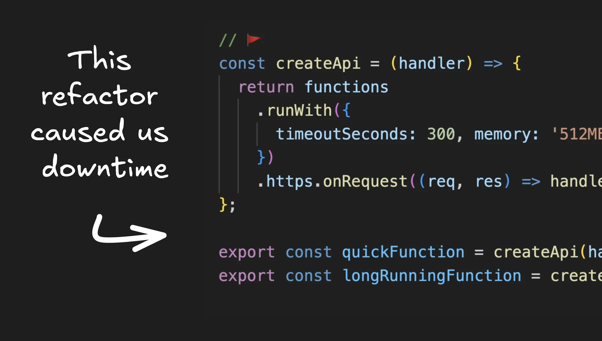
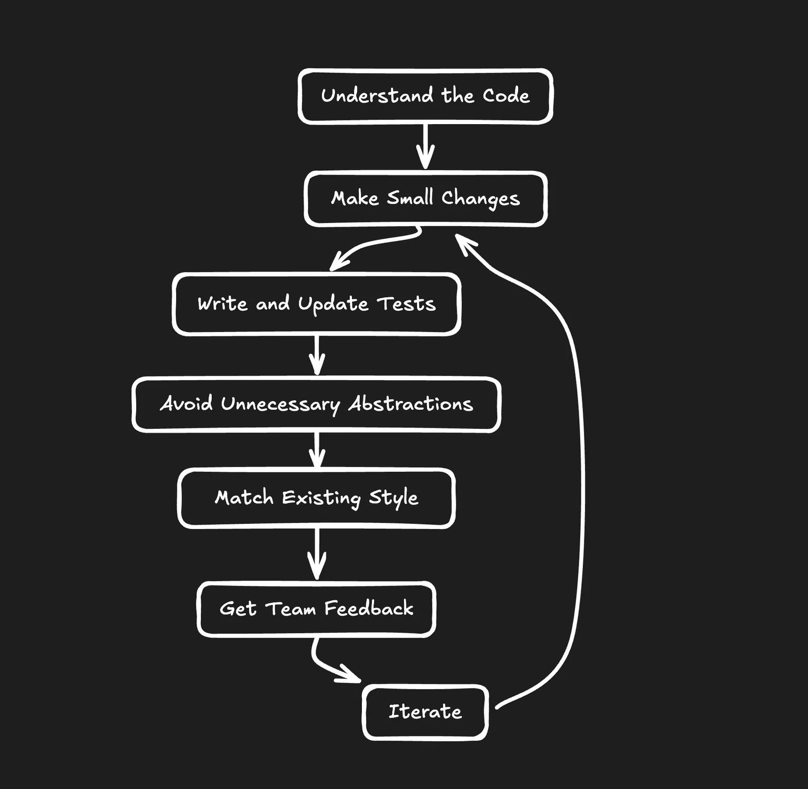

【译自】<https://www.builder.io/blog/good-vs-bad-refactoring>


这些年来，我雇佣过很多开发人员。他们当中有很多人都坚信我们的代码需要大量重构。但问题是：几乎在每一个案例中，其他开发人员都发现他们新重构的代码更难理解和维护。此外，代码的运行速度通常也更慢，漏洞也更多。

别误会我的意思。重构本质上并不是坏事。它是保持代码库健康的关键部分。问题在于，糟糕的重构就是糟糕。而且，在试图让事情变得更好的同时，我们很容易掉入让事情变得更糟的陷阱。

因此，让我们来看看什么是好的重构，什么是坏的重构，以及如何避免成为大家都害怕在代码库附近看到的那个开发人员。


## 重构的好坏与丑陋

抽象可以是好的。抽象可以是坏的。关键是要知道何时以及如何应用抽象。让我们来看看一些常见的陷阱以及如何避免它们。

### 1. 大幅改变编码风格

我见过的最常见的错误之一，就是开发人员在重构过程中完全改变编码风格。这种情况通常发生在来自不同背景的人或对特定编程范式有强烈意见的人身上。

让我们来看一个例子。假设我们有一段代码需要清理：

**重构前**：

```js
// 🫤 this code could be cleaner
function processUsers(users: User[]) {
  const result = [];
  for (let i = 0; i < users.length; i++) {
    if (users[i].age >= 18) {
      const formattedUser = {
        name: users[i].name.toUpperCase(),
        age: users[i].age,
        isAdult: true
      };
      result.push(formattedUser);
    }
  }
  return result;
}
```

**糟糕的重构**：

```js
import * as R from 'ramda';

// 🚩 adopted a completely different style + library
const processUsers = R.pipe(
  R.filter(R.propSatisfies(R.gte(R.__, 18), 'age')),
  R.map(R.applySpec({
    name: R.pipe(R.prop('name'), R.toUpper),
    age: R.prop('age'),
    isAdult: R.always(true)
  }))
);
```

虽然这个重构版本可能会吸引函数式编程爱好者，但它引入了一个新库（Ramda）和一种完全不同的编码风格。对于不熟悉这种方法的团队来说，维护起来可能是一场噩梦。

**好的重构**：

```js
// ✅ cleaner and more conventional 
function processUsers(users: User[]): FormattedUser[] {
  return users
    .filter(user => user.age >= 18)
    .map(user => ({
      name: user.name.toUpperCase(),
      age: user.age,
      isAdult: true
    }));
}
```

该版本改进了原始代码，使用了 `filter` 和 `map` 等更多惯用的 JavaScript 方法，更加简洁易读，但并没有引入全新的范式或外部依赖关系。

### 2. 不必要的抽象

我曾经雇佣过一个人，他在不了解底层代码的情况下添加了大量新的抽象概念。他们开始将不应该分组的东西分组，并且随着时间的推移（故意）产生分歧。他们合并了一些不该合并的配置（不同的 API 需要不同的配置）。

**重构前**：

```js
// 🫤 this code could be cleaner
function processUsers(users: User[]) {
  const result = [];
  for (let i = 0; i < users.length; i++) {
    if (users[i].age >= 18) {
      const formattedUser = {
        name: users[i].name.toUpperCase(),
        age: users[i].age,
        isAdult: true
      };
      result.push(formattedUser);
    }
  }
  return result;
}
```

**糟糕的重构**：

```js
// 🚩 there are way more layers and abstractions here than necessary
class UserProcessor {
  private users: User[];

  constructor(users: User[]) {
    this.users = users;
  }

  public process(): FormattedUser[] {
    return this.filterAdults().formatUsers();
  }

  private filterAdults(): UserProcessor {
    this.users = this.users.filter(user => user.age >= 18);
    return this;
  }

  private formatUsers(): FormattedUser[] {
    return this.users.map(user => ({
      name: this.formatName(user.name),
      age: user.age,
      isAdult: true
    }));
  }

  private formatName(name: string): string {
    return name.toUpperCase();
  }
}

const processUsers = (users: User[]): FormattedUser[] => {
  return new UserProcessor(users).process();
};
```

这种重构引入了一个具有多个方法的类，看起来似乎更 "面向对象"，但实际上更复杂，也更难一目了然。

**好的重构**：

```js
// ✅ cleaner and more conventional 
const isAdult = (user: User): boolean => user.age >= 18;

const formatUser = (user: User): FormattedUser => ({
  name: user.name.toUpperCase(),
  age: user.age,
  isAdult: true
});

function processUsers(users: User[]): FormattedUser[] {
  return users.filter(isAdult).map(formatUser);
}
```

该版本将逻辑分解为可重复使用的小函数，而不会引入不必要的复杂性。

### 3. 增加不一致性

我曾见过这样的情况：开发人员更新代码库的一部分，使其工作方式与其他部分完全不同，试图让它变得 "更好"。这往往会给其他开发人员带来困惑和挫败感，因为他们不得不在不同风格之间进行上下文切换。

假设我们有一个 React 应用程序，在该应用程序中，我们始终使用 React Query 来获取数据：

```jsx
// Throughout the app
import { useQuery } from 'react-query';

function UserProfile({ userId }) {
  const { data: user, isLoading } = useQuery(['user', userId], fetchUser);

  if (isLoading) return <div>Loading...</div>;
  return <div>{user.name}</div>;
}
```

现在，想象一下开发人员决定只在一个组件中使用 Redux 工具包：

```jsx
// One-off component
import { useEffect } from 'react';
import { useDispatch, useSelector } from 'react-redux';
import { fetchPosts } from './postsSlice';

function PostList() {
  const dispatch = useDispatch();
  const { posts, status } = useSelector((state) => state.posts);

  useEffect(() => {
    dispatch(fetchPosts());
  }, [dispatch]);

  if (status === 'loading') return <div>Loading...</div>;
  return <div>{posts.map(post => <div key={post.id}>{post.title}</div>)}</div>;
}
```

这种不一致性令人沮丧，因为它仅仅为一个组件引入了完全不同的状态管理模式。

更好的方法是坚持使用 React Query：

```jsx
// Consistent approach
import { useQuery } from 'react-query';

function PostList() {
  const { data: posts, isLoading } = useQuery('posts', fetchPosts);

  if (isLoading) return <div>Loading...</div>;
  return <div>{posts.map(post => <div key={post.id}>{post.title}</div>)}</div>;
}
```

该版本保持了一致性，使用 React Query 在整个应用程序中获取数据。它更简单，不需要其他开发人员只为一个组件学习新的模式。

请记住，代码库的一致性非常重要。如果您需要引入一种新模式，请首先考虑如何获得团队的认同，而不是制造一次性的不一致。

### 4. 重构前不了解代码

我见过的最大问题之一就是为了学习代码而在学习代码的过程中重构代码。这是一个糟糕的想法。我曾看到过这样的评论：你应该用 6-9 个月的时间来处理一段特定的代码。否则，你很可能会产生错误、影响性能等。

**重构前**：

```js
// 🫤 a bit too much hard coded stuff here
function fetchUserData(userId: string) {
  const cachedData = localStorage.getItem(`user_${userId}`);
  if (cachedData) {
    return JSON.parse(cachedData);
  }

  return api.fetchUser(userId).then(userData => {
    localStorage.setItem(`user_${userId}`, JSON.stringify(userData));
    return userData;
  });
}
```

**糟糕的重构**：

```js
// 🚩 where did the caching go?
function fetchUserData(userId: string) {
  return api.fetchUser(userId);
}
```

重构者可能会认为他们在简化代码，但实际上他们已经删除了一个重要的缓存机制，而该机制是为了减少 API 调用和提高性能而设置的。

**好的重构**：

```js
// ✅ cleaner code preserving the existing behavior
async function fetchUserData(userId: string) {
  const cachedData = await cacheManager.get(`user_${userId}`);
  if (cachedData) {
    return cachedData;
  }

  const userData = await api.fetchUser(userId);
  await cacheManager.set(`user_${userId}`, userData, { expiresIn: '1h' });
  return userData;
}
```

此次重构在保持缓存行为的同时，还可能通过使用更复杂的过期缓存管理器来改进缓存行为。

### 5. 了解业务背景

我曾经加入过一家公司，它背负着可怕的传统代码包袱。我领导了一个项目，将一家电子商务公司迁移到一个新的、现代的、更快的、更好的技术...... angular.js

事实证明，这项业务在很大程度上依赖于搜索引擎优化，而我们构建了一个缓慢而臃肿的单页面应用程序。

两年来，我们除了提供一个速度更慢、漏洞更多、可维护性更差的网站复制品外，什么也没提供。为什么会这样？领导这个项目的人（我--我是这个场景中的混蛋）以前从未在这个网站上工作过。我当时又年轻又笨。

让我们来看一个现代错误的例子：

**糟糕的重构**：

```js
// 🚩 a single page app for an SEO-focused site is a bad idea
function App() {
  return (
    <Router>
      <Switch>
        <Route path="/product/:id" component={ProductDetails} />
      </Switch>
    </Router>
  );
}
```

这种方法看似现代简洁，但完全是客户端渲染。对于严重依赖搜索引擎优化的电子商务网站来说，这可能是灾难性的。

**好的重构**：

```js
// ✅ server render an SEO-focused site
export const getStaticProps: GetStaticProps = async () => {
  const products = await getProducts();
  return { props: { products } };
};

export default function ProductList({ products }) {
  return (
    <div>
      ...
    </div>
  );
}
```

这种基于 Next.js 的方法提供开箱即用的服务器端渲染，这对搜索引擎优化至关重要。它还能提供更好的用户体验，加快初始页面加载速度，并为连接速度较慢的用户提高性能。Remix 也同样适用于这一目的，在服务器端呈现和搜索引擎优化方面具有类似的优势。

### 6. 过度合并代码

我曾经雇过一个人，他第一天在我们的后台工作，就立即开始重构代码。我们有很多 Firebase 函数，有些函数的设置与其他函数不同，比如超时和内存分配。

这是我们最初的设置。

**重构前**：

```js
// 😕 we had this same code 40+ times in the codebase, we could perhaps consolidate
export const quickFunction = functions
  .runWith({ timeoutSeconds: 60, memory: '256MB' })
  .https.onRequest(...);

export const longRunningFunction = functions
  .runWith({ timeoutSeconds: 540, memory: '1GB' })
  .https.onRequest(...);
```

这个人决定将所有这些函数封装在一个 `createApi` 函数中。

**糟糕的重构**：

```js
// 🚩 blindly consolidating settings that should not be
const createApi = (handler: RequestHandler) => {
  return functions
    .runWith({ timeoutSeconds: 300, memory: '512MB' })
    .https.onRequest((req, res) => handler(req, res));
};

export const quickFunction = createApi(handleQuickRequest);
export const longRunningFunction = createApi(handleLongRunningRequest);
```

这次重构将所有 API 设置为相同的设置，而无法覆盖每个 API。这是个问题，因为有时我们需要对不同的函数进行不同的设置。

更好的方法是允许 Firebase 选项通过每个应用程序接口传递

**好的重构**：

```js
// ✅ setting good defaults, but letting anyone override
const createApi = (handler: RequestHandler, options: ApiOptions = {}) => {
  return functions
    .runWith({ timeoutSeconds: 300, memory: '512MB', ...options })
    .https.onRequest((req, res) => handler(req, res));
};

export const quickFunction = createApi(handleQuickRequest, { timeoutSeconds: 60, memory: '256MB' });
export const longRunningFunction = createApi(handleLongRunningRequest, { timeoutSeconds: 540, memory: '1GB' });
```

这样，我们既能保持抽象的优势，又能保留我们所需的灵活性。在合并或抽象时，请始终考虑您所服务的用例。不要为了 "更简洁 "的代码而牺牲灵活性。确保您的抽象实现了原始实现所提供的全部功能。

说真的，在开始 "改进 "代码之前，请先了解代码。我们在下一次部署一些应用程序接口时就遇到了问题，如果不进行盲目的重构，这些问题是可以避免的。

## 如何正确重构

值得注意的是，你确实需要重构代码。但要正确对待。我们的代码并不完美，我们的代码需要清理，但要与代码库保持一致，熟悉代码，对抽象要精挑细选。

下面是一些成功重构的技巧：

1.  循序渐进：进行小规模、可控的修改，而不是大刀阔斧的改写。
2.  在进行重大重构或新抽象之前，深入理解代码。
3.  与现有代码风格相匹配：一致性是可维护性的关键。
4.  避免过多的新抽象概念：保持简单，除非确实需要复杂。
5.  避免在未获得团队认可的情况下添加新的库，尤其是编程风格迥异的库。
6.  在重构前编写测试，并在重构过程中更新测试。这能确保你保持原有的功能。
7.  让你的同事对这些原则负责。


## 更好地重构的工具和技术

为了确保您的重构是有益而非有害的，请考虑使用以下技术和工具：

### 高亮工具

使用高亮工具来执行一致的代码风格并捕捉潜在的问题。 [Prettier](https://prettier.io/)  可以帮助自动格式化为一致的风格，而 [Eslint](https://eslint.org/)  则可以帮助进行更细致的一致性检查，你可以用自己的插件轻松定制。

### Code reviews 代码审查

在合并重构代码之前，实施全面的代码审查，以获得同行的反馈意见。这有助于及早发现潜在问题，并确保重构代码符合团队标准和期望。

### 测试

编写并运行测试，确保重构代码不会破坏现有功能。[Vitest](https://vitest.dev/) 是一款快速、可靠、易用的测试运行程序，默认情况下无需任何配置。对于可视化测试，可以考虑使用 [Storybook](https://storybook.js.org/)。[React Testing Library](https://github.com/testing-library/react-testing-library)  是一套用于测试 React 组件的实用工具（还有 [Angular](https://github.com/testing-library/angular-testing-library) 和 [更多](https://github.com/testing-library) 变体）。

###  (正确的）人工智能工具

让人工智能来帮助你进行重构，至少是那些能够与你现有的编码风格和习惯相匹配的重构。

## 结论

重构是软件开发的必要组成部分，但在进行重构时需要深思熟虑，并尊重现有的代码库和团队动态。重构的目的是在不改变代码外部行为的情况下改进代码的内部结构。

请记住，最好的重构往往是最终用户看不到的，但却能大大方便开发人员的工作。它们能提高可读性、可维护性和效率，而不会破坏整个系统。

下一次，当你有为一段代码制定 "大计划 "的冲动时，请退后一步。彻底了解它，考虑更改带来的影响，然后逐步改进，你的团队一定会感谢你的。

你未来的自己（以及你的同事）会非常欣赏这种保持代码库整洁和可维护性的周到方法。
