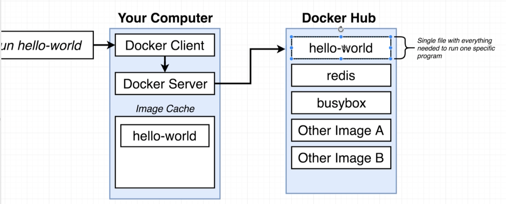

docker 提供了一种非常便利的打包机制，这种打包机制，直接打包了应用运行所需要的整个操作系统，从而保证了本地开发环境和云端环境的高度一致，避免了开发者基于不同的宿主机匹配不同运行环境之间差异的痛苦过程
容器编排器：管理一组容器、自动分配容器工作负载
docker 意图是让安装软件和运行软件更容易
docker 是一个生态，包括docker 客户端、docker server、dockerhub、docker compose等
docker生态实际上是在谈论一系列不同的项目和工具
docker 中很重要的概念是container
运行命令时，会下载一个单独的文件，也就是Image
image是一个单独的文件，包含了所有依赖和运行所需的配置文件
image 会存储在硬盘上，下次运行命令时，不需要重新下载
在需要的时候，可以使用image 创建container，container 是 image的实例，可以把container想象成一个正在运行的程序
container 有自己的隔离的硬件资源、内存空间、网络技术、硬盘空间

下载docker client
创建docker hub账号

在命令行输入 docker run xxxx的时候，意味着，要基于xxxx这个image创建一个container
在执行 docker run xxxx时，docker client 会先去docker server 中寻找xxxx image，若 docker xxxx 中没有，会去docker hub下载xxxx，若有，直接基于xxxx创建container


- 内核是一个中间层，它连接并控制着应用程序和底层硬件

- 重点：划分命名空间、分段，允许隔离资源

- name spacing 为进程隔离资源：进程
- control groups可以限制进程使用的内存量、cpu量、硬盘驱动器、I/O、网络带宽
- image是文件系统快照
- 当创建container时，实际上是将image 的文件系统快照copy了一份放到了当前容器里
- 当运行docker 时，创建的每个container 都运行在linux虚拟机内部，即时使用的是windows/mac
- docker 命令
	- docker pull image 下载image镜像
	- docker run image 基于image创建一个容器
	- docker run -p 8080:8080 image 基于image创建一个容器，并且在运行时把本机的8080端口号映射到该容器的8080端口号上（这样访问本机的8080端口就可以访问到容器中的东西）
	-  docker run image busybox ping google.com 基于image开启一个容器后，在容器中执行 ping google 命令 (会在docker ps 的 COMMAND 这一列展示)
	- docker run -it image sh 基于image开启一个容器后，打开容器的terminal
	- docker run = docker create + docker start
	- docker run -p 3001:3000 -v /app/node_modules -v $(pwd):/app <image_id>
		- 基于 `<image_id>` 创建一个容器
		- `-p 3001:3000`: 设置宿主机和容器之间的端口映射 `<宿主机端口>:<容器端口>`
		- `v /app/node_modules`： 设置一个卷映射，格式为 `-v <宿主机路径>:<容器路径>`；这里只给出了容器的路径 `/app/node_modules`，没有给出宿主机的路径，这意味着 Docker 会创建一个匿名卷；
		- 卷（Volume）：是一种数据持久化的机制，用于在 Docker 容器之间或者容器与宿主机之间共享数据。Docker 卷的一个主要用途是存储那些不应该包含在 Docker 镜像中，但是又需要在容器运行时可用的数据。Docker卷在宿主机某个地方存储。放在Docker卷中可以提高文件系统的性能，因为Docker卷本质上是读写宿主机。
		- 为什么不使用 `-v $(pwd):/app`：保护 `node_modules`， 如果使用了`-v $(pwd):/app`，把宿主机的当前目录映射到了容器的 `/app` 目录。这意味着，如果宿主机当前目录中有一个 `node_modules` 目录，它会覆盖掉容器中的 `/app/node_modules`。为了避免这种情况，你可以先创建一个匿名卷来存储 `/app/node_modules`，然后再映射 `/app`。这样，即使宿主机的当前目录中有一个 `node_modules` 目录，它也不会覆盖掉容器中的 `/app/node_modules`。
		- `-v $(pwd):/app`: 设置另一个卷映射，将容器的`/app`路径，映射到宿主机的`$(pwd)` 路径，这意味着，在宿主机上的修改，会被同步修改到容器的 `/app` 目录中
	- docker run -p 3000:3000 -v /app/node_modules -v (pwd):/app <image_id> 这句命令行中的 `-v /app/node_modules -v (pwd):/app`  是不是可以理解为，在映射容器的`/app`和宿主机的`pwd`之前，先将`node_module`创建成一个匿名卷，这样即时宿主机中有`node_modules`，容器也会去匿名卷中查找`node_modules`?
		- 是的，你的理解是正确的。
		`-v /app/node_modules` 这个参数会在 Docker 容器中创建一个匿名卷来存储 `/app/node_modules` 目录。匿名卷是 Docker 自动管理的，它的位置在宿主机的文件系统中，但是具体位置是 Docker 决定的。
		然后，`-v $(pwd):/app` 这个参数会把宿主机的当前工作目录（`$(pwd)`）挂载到容器的 `/app` 目录。这会创建一个宿主机和容器之间的双向链接，任何在宿主机的当前工作目录中的更改都会在容器的 `/app` 目录中反映出来，反之亦然。
		
		然而，因为你在之前创建了一个匿名卷来存储 `/app/node_modules`，所以即使宿主机的当前工作目录中有一个 `node_modules` 目录，它也不会覆盖掉容器中的 `/app/node_modules`。相反，容器会继续使用匿名卷中的 `node_modules`。
		这种做法可以防止宿主机的 `node_modules` 目录覆盖掉容器中的 `/app/node_modules`，同时还可以利用 Docker 卷的性能优势，提高对 `node_modules` 目录的文件操作性能。
	- docker ps 查看正在启动的容器
	- docker container ls 等同于docker ps
	- docker image ls 查看所有image镜像
	- docker images 等同于 docker image ls
	- docker ps -a 查看所有容器
	- docker exec 可以再运行中的容器中执行命令
	- docker system df 查看docker 占用系统情况
	- docker system prune 清理掉不活跃的占用（container、image），image总数不会变
- 
- 
- docker logs +containerId 插卡容器日志
- docker stop 停止容器，发送 SIGTERM 信号给容器，容器接收到信号后，执行相关逻辑并停止（软着陆）（推荐这个）（如果10s内没有关完，docker会自动触发docker kill）
- docker kill 杀掉容器，发送SIGKILL 给容器，容器什么也不需要做，立即停止（强行关闭，硬着陆）
- Dockerfile - 自定义镜像
- Dockerfile 三部曲
	- 规定基础镜像
	- 运行命令来安装必要的依赖、程序
	- 规定容器启动参数
```
# 三步曲1：规定基础镜像
# 基础镜像可以理解为操作系统，我们在安装其他程序前，需要先安装操作系统
FROM alpine

# 三步曲2：运行命令来安装必要的依赖、程序
# apk 是 alpine 内建的包管理命令，我们使用这个包管理程序安装 redis
RUN apk add --update redis

# 三步曲3：规定容器启动参数
CMD ["redis-server"] 作者：无限咪咪 https://www.bilibili.com/read/cv21266100 出处：bilibili
```

- docker build . 依据当前文件夹下的 Dockerfile文件 构建成一个image
- docker build -f path/filename . 根据制定的文件，构建一个image，-f = --file
- docker build -t leylatop/redis:latest  指定image的tag（\[你的DockerID\]/\[镜像名\]:\[版本号\]
- docker image build 等同于 docker build .
- docker commit -c 'CMD \["redis-server"\]' container-id 将某个container构建成一个image，并在container创建成功之后，执行-c里面的命令
- 创建node-app image的步骤


```
# 选择一个基础镜像
FROM node:14-alpine

# 设置后续命令，及进入容器shell后 的起始目录
WORKDIR /usr/app

# 构建镜像时，将自己写的代码拷贝到容器的文件系统中
COPY ./ ./

# 安装依赖
RUN npm install

# 容器启动参数
CMD ["npm", "start"]
```

- docker-compose up 启动根目录下docker-compose.yml 中的一系列容器，并保持状态
- docker-composer up -d  启动根目录下docker-compose.yml 中的一系列容器，不保持运行状态
- docker-compose up --build 构建Dockerfile镜像，并启动docker-compose.yml 中的容器
- docker-compose down 关闭根目录下docker-compose.yml 中的一系列容器
- docker-compose ps 读取当前目录下的docker-compose.yml文件，查看当前目录下正在运行的container（没有 docker-compose.yml会报错）