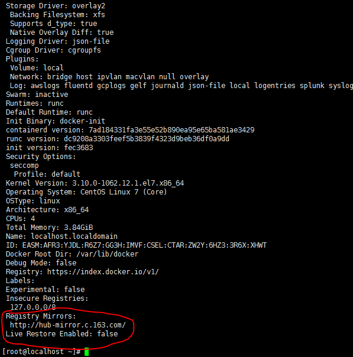

解决方法，配置docker国内镜像
1. 创建或修改 /etc/ docker/daemon.json 文件，修改为如下形式
```json
{
    "registry-mirrors": [
        "https://docker.m.daocloud.io",
        "https://docker.kubesre.xyz",
        "https://huecker.io",
        "https://dockerhub.timeweb.cloud",
        "https://dockerproxy.com",
        "https://docker.anyhub.us.kg",
        "https://dockerhub.icu",
        "https://docker.aws19527.cn",
        "https://registry.dockermirror.com",
        "https://hub-mirror.c.163.com",
        "https://mirror.baidubce.com",
        "https://ccr.ccs.tencentyun.com",
        "https://docker.mirrors.ustc.edu.cn"
    ]
}
```

2. 加载重启docker
```
$ sudo systemctl daemon-reload
$ sudo systemctl restart docker
```

3. 查看是否成功
```
docker info
```


